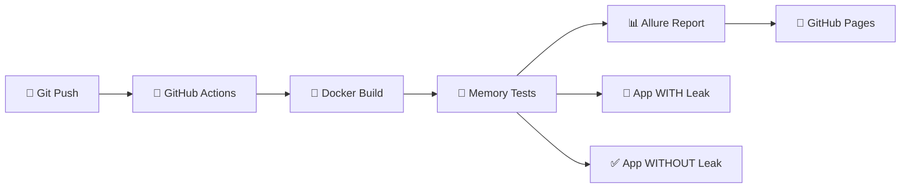

# 🚀 Memory Leak Detection Demo

> **Быстрый демо CI/CD pipeline для обнаружения утечек памяти**

## 🎯 Что это?

Демо-проект, показывающий автоматическое обнаружение утечек памяти в CI/CD pipeline с красивыми отчетами в Allure.

## ⚡ Быстрый запуск (2 минуты)

### 1. 🚀 Запуск демо CI
```bash
# На GitHub: Actions → Demo CI → Run workflow
# Или просто push в main - автоматически запустится демо
```

### 2. 📊 Посмотреть результаты
- **Allure отчет**: https://sermkaym1.github.io/memory-leak-ci-demo/allure-report/
- **GitHub Actions**: [Logs и статус](https://github.com/Sermkaym1/memory-leak-ci-demo/actions)

## 🎭 Что демонстрирует

| 🎯 Фича | ⏱️ Время | 📊 Результат |
|---------|--------|------------|
| **Обнаружение утечки** | 30 сек | 🚨 Алерт + график роста памяти |
| **Здоровое приложение** | 30 сек | ✅ Подтверждение отсутствия утечек |  
| **Allure отчеты** | 1 мин | 📈 Красивые графики + детали |
| **CI/CD интеграция** | 2 мин | 🤖 Автоматический анализ |

## 📈 Демо архитектура



## 🎨 Визуализация результатов

### 📊 Allure отчет включает:
- 📈 **Интерактивные графики** потребления памяти
- 🎯 **Четкие вердикты**: "Утечка обнаружена" / "Приложение здоровое"
- ⏱️ **Временные метрики** и статистика
- 📝 **Детальные логи** каждого шага
- 🏷️ **Теги и категории** для удобной навигации

### 🔍 Примеры графиков:
- **🚨 С утечкой**: Растущая кривая RSS памяти
- **✅ Здоровое**: Стабильная линия потребления

## 🚀 Варианты запуска

| 🎮 Режим | ⏱️ Время | 🎯 Назначение |
|----------|--------|-------------|
| `demo` | 1 мин | 🎭 Быстрая демонстрация |
| `quick` | 2 мин | ⚡ Быстрые проверки |
| `full` | 10 мин | 🔬 Детальный анализ |
| `performance` | 15 мин | 📊 Нагрузочное тестирование |

## 🛠️ Технологии

- **CI/CD**: GitHub Actions
- **Контейнеризация**: Docker + Docker Compose  
- **Тестирование**: pytest + Allure
- **Мониторинг**: psutil + Docker SDK
- **Графики**: matplotlib + numpy
- **Отчеты**: Allure Framework + GitHub Pages

## 📱 Мониторинг (опционально)

```bash
# Запуск Grafana dashboard локально
docker-compose up grafana prometheus

# Доступ: http://localhost:3000 (admin/admin)
```

## 🎯 Кейсы использования

✅ **Подходит для**:
- Демонстрации CI/CD capabilities
- Обучения DevOps практикам
- Быстрого прототипирования memory testing
- Показа автоматизации QA процессов

## 🏁 Quick Start Commands

```bash
# 1. Клонировать репозиторий
git clone https://github.com/Sermkaym1/memory-leak-ci-demo.git
cd memory-leak-ci-demo

# 2. Локальный запуск (если нужно)
docker-compose up -d
python -m pytest tests/test_demo.py -v --alluredir=allure-results

# 3. Посмотреть отчет локально  
allure serve allure-results

# 4. Или просто push в main для автоматического CI
git add . && git commit -m "demo" && git push
```

---

**🎭 Perfect for demos, fast enough for CI, beautiful enough for presentations!**